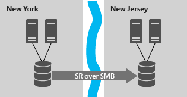
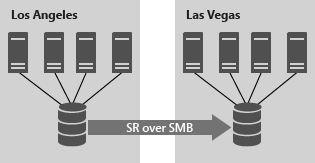
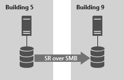

# Storage Replica overview

Storage Relica trên Windows server là 1 công nghệ cho phép nhân bản volumes giữa các máy chủ hoặc cluster để khôi phục sau khi có thảm họa (DR - Disaster Recovery). 

Nó cho phép ta tạo các cluster dự phòng trên 2 site, với các node luôn được đồng bộ.

SR hỗ trợ nhân bản đồng bộ (synchronous replication) và nhân bản không đồng bộ (asynchronous replication):
- **Synchronous replication**: Ánh xạ dữ liệu của site trong mạng với độ trễ thấp (low-latency) với volumes gặp sự cố để đảm bảo không bị mất mát dữ liệu ở cấp độ file hệ thống (file-systems) khi bị lỗi.
- **Asynchronous replication**: Ánh xạ dữ liệu của site bên ngoài phạm vị vật lý qua các liên kết mạng có độ trễ cao hơn (higher lencies), nhưng không có sự đảm bảo cả 2 site đều có các bản sao dữ liệu giống hệt nhau tại thời điểm xảy ra sự cố, hay thời điểm bị lỗi.

## Tại sao lại là Storage Replica?
SR cung cấp khả năng phục hồi (recovery) và chuẩn bị cho thảm họa trên Windows Server.

SR cho phép sử dụng hiệu quả trên nhiều DC. Bằng cách mở rộng cluster hoặc replicate cluster, workloads có thể được chạy trên nhiều DC để người dùng cũng như ứng dụng cục bộ truy cập dữ liệu nhanh hơn, cũng như việc phân phối tỉa và sử dụng tài nguyên máy tính tốt hơn. Nếu 1 bên DC gặp sự cố dẫn đến offline, ta có thể chuyển tạm thời workload của nó sang DC còn lại để dịch vụ không bị stop.

## Cấu hình được hỗ trợ
Ta có thể triển khai SR theo 3 kịch bản:
- Mở rộng cluster (Stretch Cluster)
- Cluster-to-Cluster
- Server-to-Server

### **Stretch Cluster** 


```
SMB : Server message Block : Giao thức chia sẻ tệp mạng cho phép các ứng dụng trên máy tính đọc và ghi vào tệp và yêu cầu dịch vụ từ các ứng dụng trên các máy trong mạng
```

Cho phép cấu hình trên 1 cluster đơn lẻ, trong đó một số node chia sẻ một bộ lưu trữ bất đối xứng (asymmetric storage) với một số node khác, sau đó Synchronous replication hoặc Asynchronous replication để phòng bị với site khác đã biết. 

Kịch bản này có thể sử dụng Storage Spaces với bộ nhớ SAS dùng chung, SAN và LUNs đính kèm với iSCSI.

**Quản lý:** Nó được quản lý bằng PowerShell và Failover Cluster Manager graphical tool, và cho phép tự động chuyển đổi dự phòng workload.

### Cluster-to-Cluster


Cho phép nhân bản giữa 2 cluster riêng biệt, trong đó 1 cluster là nhân bản đồng bộ hoặc không đồng bộ với 1 cluster khác.

Kịch bản này có thể sử dụng cho Storage Spaves Direct, Storage Spaces với bộ nhớ SAS được dùng chung, SAN và các LUNs đính kèm iSCSI.

**Quản lý:** Được quản lý bằng Windows Admin Center và PowerShell. Và nó yêu cầu can thiệp thủ công để chuyển đổi dự phòng.

### Server-to-Server


Cho phép nhân bản đồng bộ hoặc không đồng bộ trên 2 server riêng biệt.

Kịch bản này sử dụng Storage Spaces với bộ nhớ SAS dùng chung, SAN và LUNs đính kèm với iSCSI và ổ đĩa cục bộ.

**Quản lý:** Được quản lý bằng Windows Admin Center và PowerShell. Và nó yêu cầu can thiệp thủ công để chuyển đổi dự phòng.

## Tính năng của Storage Replica
- **Zero data loss, block-level replication**: Với tính năng nhân bản đồng bộ, nó khôgn có khả năng mất dữ liệu. Với block-level replication, không có khả năng file bị lock.

- **Simple deployment and management**: Triển khai và quản lý đơn giản. Việc tạo replication partnership giữa 2 server có thể sử dụng trên Windows Admin Center. Triển khai Stretch cluster sử dụng giao diện trực quan với công cụ quen thuộc Failover Cluster Manager tool.

- **Guest and host**: Tất cả các năng lực của SR đêu được hiển thị trên cả máy khách ảo (virtualized guest) và máy chủ triển khai (host-based deployments). Điều này có nghĩa là Guest có thể nhân bản dữ liệu trên volume của họ ngay cả khi không chạy trên nền tảng ảo hóa của Windows hoặc trên public cloud, miễn là Guest sử dụng Windows Server.

- **SMB3-based**: Storage Replica sử dụng công nghệ đã được kiểm chứng và hoàn thiện của SMB 3, được phát hành lần đầu trong Windows Server 2012. Điều này có nghĩa là tất cả các đặc điểm nâng cao của SMB - chẳng hạn như hỗ trợ đa kênh và SMB trực tiếp trên các card mạng RoCE, iWARP và InfiniBand RDMA - đều có sẵn cho Storage Replica.

- **Security**: Storage Replica có công nghệ bảo mật tích hợp sẵn. Nó bao gồm packet signing, mã hóa toàn bộ dữ liệu AES-1280GCM, hỗ trợ tăng tốc mã hóa cho Intel AES-NI, và xác thực toàn vẹn phòng chống tấn công man-in-the-middle.

- **High performance initial sync**: SR hỗ trợ việc khởi tạo đồng bộ (initial sync). Initial replicateion chỉ copy những block khác nhau, có khả năng rút ngắn thời gian đồng bộ hóa ban đầu và ngăn dữ liệu sử dụng hết băng thông. 

- **Consistency groups**: Đảm bảo cho các ứng dụng như Microsoft SQL Server có thể ghi vào nhiều ổ đĩa nhân bản và biết được dữ liệu được ghi tuần tự trên máy chủ đích.

- **User delegation**: User có thể được cấp quyền để quản lý bản sao mà không cần trong Administrator Group trên các node nhân bản, do đó có thể hạn chế quyền truy cập của User vào các khu vực không liên quan.

- **Network Constraint**: SR có thể được giới hạn cho các mạng riêng lẻ theo server và replicate volumes, để cung cấp băng thông cho ứng dụng, backups và phần mềm quản lý.

- **Thin provisioning**: 

## Điều kiện sử dụng Storage Replica
- Active Directory Domain Services

- Storage Spaces: với SAS JBODs, Storage Spaves Direct, fibre channel SAN, shared VHDX, iSCSI, hoặc local storage SAS/SCSI/SATA. Microsoft khuyến khi sử dụng SSD cho các ổ lưu log. Log volume không bao giờ được sử dụng cho workload.

- Có ít nhất 1 kết nối ethernet / TCP trên mỗi server để synchronous relication. Tốt nhất là RDMA (Remote Direct Memory Access)

- Cấu hình tối thiểu: 2 GB RAM, 2 Cores CPU

- Network giữa các server đủ băng thông. Synchronous replication khuyến nghị độ trễ trung bình (round trip letency) là 5ms hoặc thấp hơn. Asynchronous replication không khuyến nghị latency.

- Phiên bản: Windows Server, Datacenter Edition hoặc Windows Server, Standard Edition
    - Đối với Windows Server, Standard Edition có những hạn chế sau:
        - Cần phiên bản Windows server 2019 trở lên
        - SR nhân bản 1 volume duy nhất thay vì không giới hạn
        - Giới hạn dung lượng của volume là 2TB thay vì unlimited.
- 


# Tham khảo:
- https://docs.microsoft.com/en-us/windows-server/storage/storage-replica/storage-replica-overview