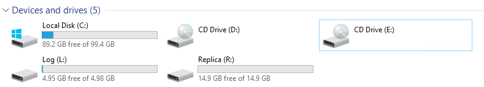
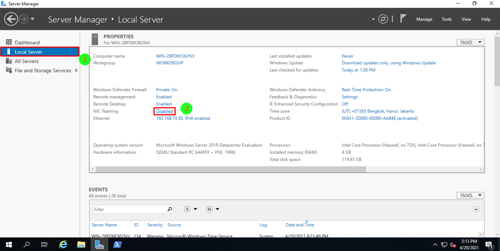

# Cài đặt và cấu hình Storage Replica trên Windows 2019 server Datacenter Edition

# Yêu cầu: 
2 máy cài đặt sẵn HĐH Windows Server 2019 Datacenter Edition

- WIN-PC01: 192.168.10.37/24
- WIN-PC02: 192.168.10.30/24

Mỗi máy có 2 phân vùng giống hệt nhau. 1 là nơi Relicate dữ liệu, 2 là nơi lưu Log.

Máy 1:


Máy 2:



# Cấu hình:
## Cài đặt tính năng Storage Replication trên cả 2 máy
```
Enable `NIC Teaming`:


```

Enabled Storage Replica:


Sau khi quá trình hoàn tất ta sẽ thấy có thông báo yêu cầu Restart OS:


Restart OS.

## Cấu hình Active Directory Domain
### Cấu hình máy win-PC01 làm controller


Truy cập lại bằng tài khoản `Administrator@vnptcloud.local`., Mật khẩu: pass đã đặt ở trên

Sau khi truy cập, ta sẽ thấy máy đã Join Domain.


### Tiến hành Join Domain trên máy WIN-PC02:
Chuyển DNS thành IP của máy controller:


Cấu hình join domain


Đợi restart và truy cập bằng user Truy cập lại bằng tài khoản `Administrator@vnptcloud.local`., Mật khẩu: pass đã đặt ở trên


Quay lại máy win-PC01, Mở **“Active Directory Users and Computers”** để kiểm tra:


Ta đã thấy máy vừa join domain.


## Create reolication partnership
Tạo mối quan hệ giữa 2 máy. 

Trên máy WIN-PC01, khởi chạy PowerShell bằng quyền Administrator. Chạy đoạn lệnh sau:

```powershell
New-SRPartnership -SourceComputerName WIN-PC01 -SourceRGName Replication01 -SourceVolumeName R: -SourceLogVolumeName L: -DestinationComputerName WIN-PC02 -DestinationRGName Replication02 -DestinationVolumeName R: -DestinationLogVolumeName L: 
```

**Trong đó:**
- `-SourceComputerName WIN-PC01` : Tên máy cần replicate dữ liệu (`WIN-PC01`)
- `-SourceRGName Replication01` : Đặt tên cho Replica Group của máy nguồn (`Replication01`)
- `-SourceVolumeName R:` : Ổ lưu dữ liệu cần replicate trên máy nguồn (`R:\`)
- `-SourceLogVolumeName L:` : Ổ lưu log trên máy nguồn WIN-PC01 (`L:\`)
- `-DestinationComputerName WIN-PC02`: Tên máy nhận replicate dữ liệu (`WIN-PC02`)
- `-DestinationRGName Replication02` : Đặt tên cho Replica Group của máy nhận WIN-PC02(`Replication02`)
- `-DestinationVolumeName R:` : Ổ lưu dữ liệu cần replicate trên máy nhận WIN-PC02(`R:\`)
- `-DestinationLogVolumeName L:` : Ổ lưu log trên máy nhận WIN-PC02(`L:\`)

Output:
```
DestinationComputerName : WIN-PC02
DestinationRGName       : Replication02
Id                      : 5c3249a1-b3ef-4bca-a804-92ba4ea46a35
SourceComputerName      : WIN-PC01
SourceRGName            : Replication01
PSComputerName          :
```


# Tham khảo:
- https://docs.microsoft.com/en-us/windows-server/storage/storage-replica/server-to-server-storage-replication
- https://nedimmehic.org/2017/02/22/configure-storage-replication-server-to-server/