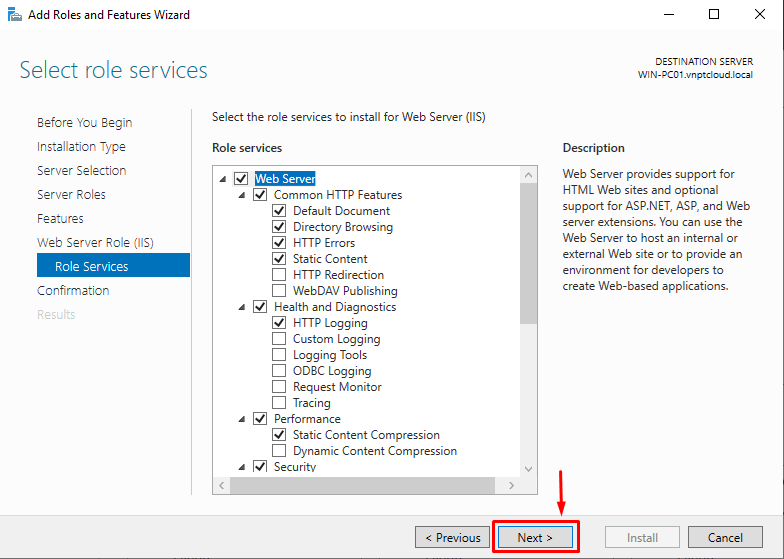

# Cài đặt IIS trên Windows server 2019

# Giới thiệu
IIS là dịch vụ 1 web server trên Windows cung cấp sự an toàn, dễ quản lý, modular và có thể mở rộng để lưu trữ các trang web, dịch vụ và ứng dụng 1 cách đáng tin cậy. (Theo Microsoft)

# Cài đặt
Khởi chạy **Server Manager**:


Trên giao diện Server Manager, chọn **Manager** -> chọn **Add Roles an Features**


Hệ thống hiện ra màn hình **Add Roles and Features Wizard**, chọn **Next**:


Chọn **Role-based or feature-based-installation** -> click **Next**


Chọn Server bạn muốn cài đặt IIS -> Click **Next**


Chọn Roles **Web Server (IIS)**


Một Pop-up hiện lên, hỏi lại bạn có muốn thêm tính năng Web Server (IIS) hay không -> chọn **Add Features**


Chọn **Next**:


Chọn **Next**:


Chọn **Next**:


Tiếp đến phần Role Services, tùy vào nhu cầu, có thể chọn thêm các tính năng của IIS. Ở đây, ta để mặc định. Click **Next**:



Click **Install** để tiến hành cài đặt:


Sau khi quá trình cài đặt hoàn tất, click chọn **Close**


# Khởi chạy IIS Webserver:
Trên giao diện Server Manager, chọn **Tool** -> **Internet Infomation Services (IIS) Manager**


Giao diện IIS Manager hiện ra như hình:


Truy cập tới IP của Server cài IIS, ta sẽ thấy giao diện tương tự dưới đây:


# Upload 1 trang web
## Upload 1 trang html
Tạo thư mục chứa code web. Ở đây, ta tạo ở ổ `R:\`:

Thư mục là: `vnptcloud.local`. Ta tạo 1 file là `index.html` với nội dung:
```html
<h1>Hello VNPT Cloud !</h1>
```


Trên IIS Manager, chuột phải phần **Sites** -> Chọn **Add Website...**


Trên giao diện Add Website, điền các thông tin -> click **OK**


- 1 : Tên của trang web
- 2 : Đường dẫn thư mục chứa code web
- 3 : Port bind trang web
- 4 : Địa chỉ truy cập trang web

Sau khi thêm, ta sẽ thấy site được thêm hiển thị:


Do tên miền là tên miền local nên ta thực hiện trỏ file hosts trên Windows. Đường dẫn file hosts trên Windows:
```
C:\Windows\System32\drivers\etc\hosts
```
Thêm dòng:
```
127.0.0.1 vnptcloud.local
```


Mở trình duyệt, truy cập vào `http://vnptcloud.local/` sẽ có kết quả như hình dưới:


## Upload 1 Site ASP
Cấu hình thêm 

